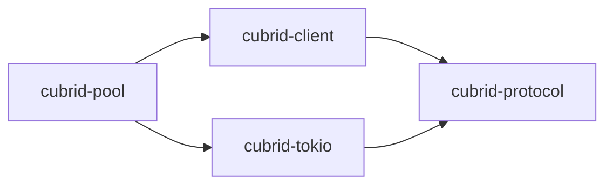

# Architecture

## Workspace Layout

```mermaid
flowchart TD
    A[cubrid-rs/]
    A --> B[crates/]
    B --> C[cubrid-protocol/\nWire protocol (CAS) - no I/O]
    C --> C1[src/lib.rs\nConstants, codec, packet framing, error types]
    B --> D[cubrid-client/\nSync client - std::net::TcpStream]
    D --> D1[src/lib.rs\nClient, Connection, Row, Statement]
    B --> E[cubrid-tokio/\nAsync client - tokio::net::TcpStream]
    E --> E1[src/lib.rs\nAsyncClient, AsyncConnection]
    B --> F[cubrid-pool/\nConnection pooling]
    F --> F1[src/lib.rs\nPool, PoolConfig]
    A --> G[examples/\nRunnable examples]
    A --> H[tests/\nIntegration tests (need Docker CUBRID)]
    A --> I[docs/\nDocumentation]
```

## Dependency Graph



## Design Principles

1. **No unsafe code** - `#![deny(unsafe_code)]` in all crates
2. **No FFI** - pure Rust CAS protocol over TCP
3. **Protocol-first** - `cubrid-protocol` is I/O-agnostic; clients bring their own transport
4. **Minimal dependencies** - only `thiserror`, `bytes`, `tokio`
