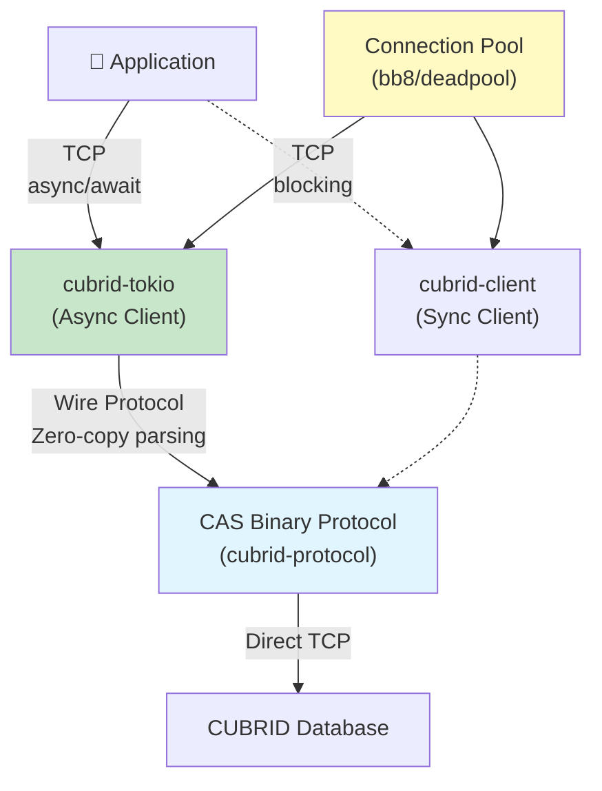
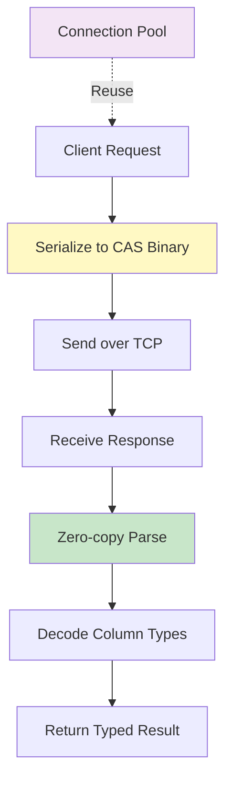

# Performance

This document describes the performance characteristics of `cubrid-rs`, a pure Rust CAS (CUBRID Access Server) protocol implementation.

## Overview

`cubrid-rs` is a **zero-FFI, native Rust implementation** of the CUBRID binary protocol (CAS). All wire protocol parsing and serialization happens in pure Rust with no C bindings, enabling:

- **Zero-copy parsing** of protocol buffers where applicable
- **Async/await support** via Tokio for non-blocking I/O
- **Connection pooling** strategies via `bb8` or `deadpool`
- **Memory safety** enforced by Rust's ownership model



### Performance Philosophy

1. **Protocol efficiency** — CAS is a binary protocol with minimal overhead; no JSON serialization
2. **No intermediate allocations** — Zero-copy buffers for large result sets where possible
3. **Async-first for I/O** — Tokio allows thousands of concurrent connections with minimal CPU overhead
4. **Pluggable pooling** — Use `bb8` for connection pooling via middleware, or `deadpool` for generic object pools

## Performance Characteristics

### Latency Profile

- **Connection establishment**: ~5–10ms (TCP handshake + CAS login)
- **Single query (roundtrip)**: Protocol parsing overhead is negligible (~<1ms) compared to database processing
- **Batch operations**: Multiple queries in a single TCP roundtrip reduce latency significantly

### Memory Usage

| Component | Memory Profile |
|-----------|-----------------|
| `cubrid-protocol` | ~0 (stateless codec library) |
| `AsyncClient` | ~1–2 KB per connection (Tokio task overhead) |
| `SyncClient` | ~512 bytes per connection (minimal state) |
| Connection Pool (bb8) | O(pool_size × connection_mem) |
| Result Set (unbuffered) | Streamed—no full materialization in memory |

### CPU Efficiency

- **Protocol parsing**: Single-pass, no regex or external parsing libraries
- **Async runtime**: Tokio's work-stealing scheduler minimizes context switches
- **Connection pooling**: Reusing connections eliminates TCP handshake overhead

### Request/Response Flow



## Optimization Tips

### 1. Use Async Client for I/O-Heavy Workloads

```rust
use cubrid_tokio::Client;

// Async client allows thousands of concurrent requests
let client = Client::connect("dba", "localhost", 33000, "demodb").await?;

// Multiple concurrent queries
let (res1, res2) = tokio::join!(
    client.execute("SELECT * FROM table1"),
    client.execute("SELECT * FROM table2")
);
```

### 2. Enable Connection Pooling

```rust
use cubrid_pool::{Pool, PoolConfig};
use cubrid_tokio::Client;

let config = PoolConfig::default()
    .max_size(20)
    .min_idle(5);

let pool = Pool::new(config, || async {
    Client::connect("dba", "localhost", 33000, "demodb").await
}).await?;

// Reuse connections across requests
let conn = pool.get().await?;
```

### 3. Batch Statements for Bulk Operations

```rust
// Instead of executing many single inserts:
//   for item in items { client.execute("INSERT ...").await?; }
//
// Use batch/bulk if available, or prepare statements and reuse them
let stmt = client.prepare("INSERT INTO t (a, b) VALUES (?, ?)").await?;
for item in items {
    stmt.execute(&[item.a, item.b]).await?;
}
```

### 4. Monitor Connection Pool Saturation

When the pool is exhausted, requests queue. Monitor:
- Pool size vs. peak concurrent requests
- Connection age (reuse efficiency)
- Failed connection attempts

### 5. Use Sync Client Only for Low-Concurrency Scenarios

If you have <10 concurrent requests or blocking context (sync Rust):

```rust
use cubrid_client::Client;

let mut client = Client::connect("dba", "localhost", 33000, "demodb")?;
let result = client.execute("SELECT * FROM table1")?;
```

The sync client avoids Tokio overhead but cannot handle many concurrent requests efficiently.

## Running Benchmarks

### Current Status (v0.1.0)

**Benchmarks planned for v0.2.0 milestone**. Criterion-based benchmarks will measure:
- Connection establishment time
- Single query latency (by query type: SELECT, INSERT, UPDATE, DELETE)
- Batch operation throughput
- Memory usage under load
- Connection pooling efficiency

### Setting Up Benchmarks (v0.2.0+)

Once criterion benchmarks are integrated:

```bash
# Run all benchmarks
cargo bench

# Run specific benchmark group
cargo bench -- --bench protocol_parsing
cargo bench -- --bench connection_pooling

# Run with detailed output
cargo bench -- --verbose
```

### Manual Performance Testing (v0.1.0)

For now, use release mode tests to get rough performance data:

```bash
# Run all tests in release mode (optimized)
cargo test --release

# Run a specific test in release mode
cargo test --release test_query_latency -- --ignored

# Profile with perf (Linux)
cargo build --release --bench my_bench
perf record -g ./target/release/my_bench
perf report
```

### External Benchmarks

See [`cubrid-benchmark`](https://github.com/cubrid-labs/cubrid-benchmark) for comparative benchmarks across:
- cubrid-rs (pure Rust)
- cubrid-python (Python wrapper)
- cubrid-node (Node.js wrapper)
- Official Go driver

## Benchmark Environment

Benchmark environment details will be available once criterion-based benchmarks are integrated.

### Expected Setup (v0.2.0+)

- **Hardware**: AWS t4g.medium (ARM, 2 vCPU, 4 GB RAM) or equivalent
- **CUBRID**: Latest stable (11.4+)
- **Network**: localhost (no network latency)
- **Workload**: Synthetic queries (INSERT, SELECT, UPDATE, DELETE)
- **Concurrency**: Single-threaded, then multi-threaded scalability

## Related Documentation

- [Architecture](./ARCHITECTURE.md) — Crate structure and design
- [Protocol Research](./PROTOCOL_RESEARCH.md) — CAS protocol details
- [`cubrid-benchmark`](https://github.com/cubrid-labs/cubrid-benchmark) — Comparative benchmarks across drivers
