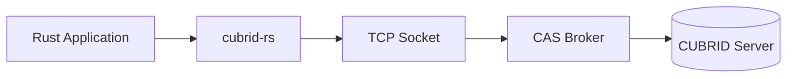
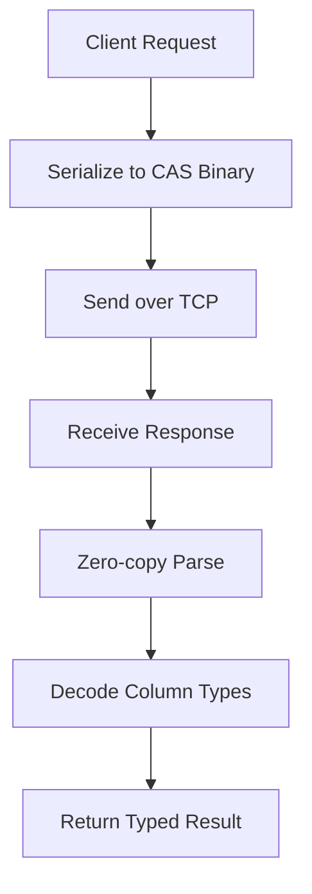

# Performance

Performance characteristics and optimization guidance for the cubrid-rs Rust driver.

## Overview



cubrid-rs is a **pure Rust** implementation of the CUBRID CAS binary protocol, reverse-engineered
from the Go, TypeScript, and Python driver implementations. It uses no C bindings or FFI — the
entire protocol stack is implemented in safe Rust with async I/O via `tokio`.

## Performance Characteristics



### Strengths

- **Pure Rust / No FFI**: No overhead from crossing language boundaries
- **Async I/O**: Built on `tokio` for efficient non-blocking I/O
- **Zero-copy parsing**: Response buffers are parsed in-place where possible
- **Strong typing**: Compile-time type safety eliminates runtime type checks
- **Memory safety**: No manual memory management, no buffer overflows

### Current Limitations

- **v0.1.0**: Initial release, not yet optimized for throughput
- **No connection pooling built-in**: Use `bb8` or `deadpool` for pooling
- **Single-connection benchmarks not yet available**

## Benchmark Results

> **Status**: Benchmarks planned for v0.2.0 milestone.

Criterion-based benchmarks will be added to measure:
- Connection establishment latency
- Query execution throughput (INSERT, SELECT, UPDATE, DELETE)
- Prepared statement reuse efficiency
- Concurrent connection performance

Benchmark environment details will be available once criterion-based benchmarks are integrated.

## Optimization Tips

1. **Use connection pooling**: Integrate `bb8-cubrid` or `deadpool` to reuse connections
2. **Prefer prepared statements**: Reuse prepared statements for repeated queries
3. **Batch operations**: Group inserts into transactions to reduce round-trips
4. **Release builds**: Always benchmark with `cargo build --release` (debug builds are 10-100× slower)
5. **Tokio runtime**: Use multi-threaded runtime (`#[tokio::main]`) for concurrent workloads

## Running Benchmarks

Once criterion benchmarks are added:

```bash
# Run all benchmarks
cargo bench

# Run specific benchmark
cargo bench --bench connect

# Run tests in release mode (current option)
cargo test --release
```

## Related

- [cubrid-benchmark](https://github.com/cubrid-labs/cubrid-benchmark) — Multi-language benchmark suite
- [PROTOCOL_RESEARCH.md](./PROTOCOL_RESEARCH.md) — CAS protocol reverse engineering documentation
